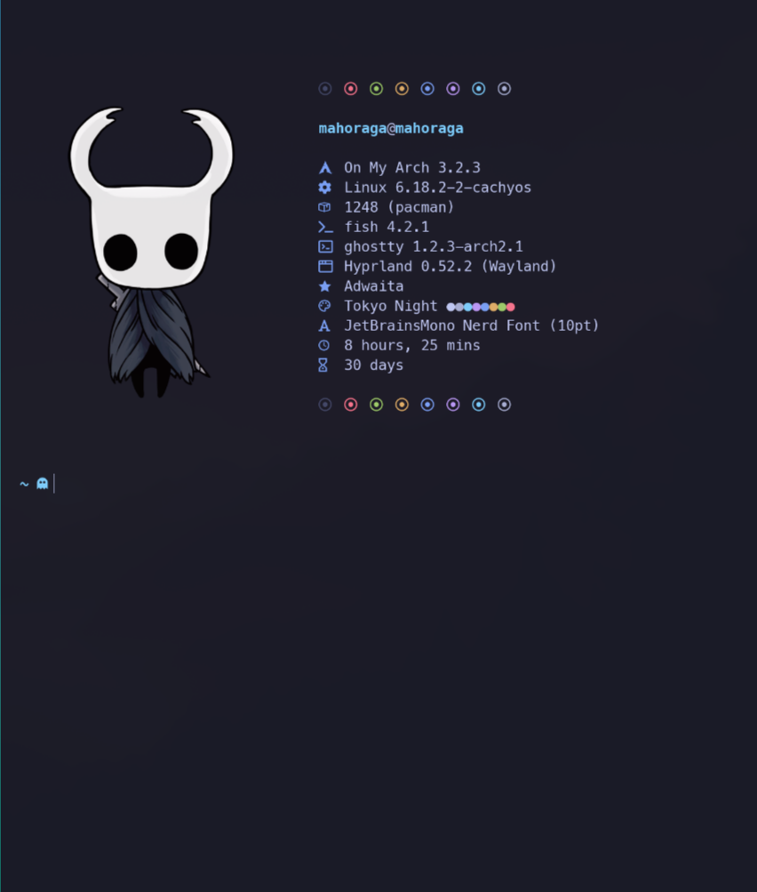

# DOT_RAGA 🧬✨


The Ultimate Aesthetic Dotfiles Suite — a vibrant, curated configuration collection designed specifically for Omarchy Linux users. DOT_RAGA delivers a polished UI/UX, sensible defaults, and an anima[...]

> ⚠️ CRITICAL WARNING  
> These dotfiles are strictly for **Omarchy Linux**. Using them on other distributions (vanilla Arch, Fedora, etc.) is **not supported** and may break your window manager or desktop environment.

---

## Table of Contents
- [Visual Tour](#visual-tour)
- [Quick Install](#quick-install)
- [Installer (install.sh)](#the-installer-installsh)
- [Smart Backup Logic](#smart-backup-logic)
- [Project Structure](#project-structure)
- [Usage & Recommendations](#usage--recommendations)
- [Contributing](#contributing)
- [Credits & Acknowledgments](#credits--acknowledgments)

---

## Visual Tour

### Desktop Experience
The full "Emerald-Neon" visual theme — clean workspaces, integrated theming, and animated touches.


### Waybar (The Raga Bar)
A heavily customized, gradient-rich status bar.

  
Motion Preview: [assets/waybar_1.mp4](assets/waybar_1.mp4)

### Fastfetch
Custom system fetch display branded for DOT_RAGA.

  
Live Demo: [assets/general_preview_2.mp4](assets/general_preview_2.mp4)

---

## Quick Install

Clone and run the installer (interactive and non-destructive):

```bash
git clone https://github.com/Maho0Raga/dot_raga.git
cd dot_raga
chmod +x install.sh
./install.sh
```

---

## The Installer (install.sh)

`install.sh` is an interactive installer built to be both safe and stylish.

Key features
- Vibrant UI: Animated spinners, progress bars, and the "Emerald-Neon" aesthetic.
- Selective install: Choose exactly what to install (Waybar, Fastfetch, Hyprland, Starship, etc.) with simple Yes/No prompts.
- Safety-first: The script never overwrites existing configs without creating backups.

What the installer does
- Detects existing config files/folders.
- Shows a summary of planned changes before applying them.
- Creates backups in a structured `_backups` location (see Smart Backup Logic).

---

## Smart Backup Logic

- Folders (Waybar, Fastfetch, Hypr): Keeps up to 2 recent backups in a dedicated `_backups` folder to save disk space.
- Files (Starship): Maintains a single rotating backup file for `starship.toml`.
- Verification: Installer displays a summary and waits for confirmation before making changes.

---

## Project Structure

Each module contains its own assets and configurations.

dot_raga/
├── assets/              # Screenshots and preview videos  
├── fastfetch/           # System fetch configuration  
├── hypr/                # Hyprland visuals (lockscreen & look & feel)  
├── omarchy/             # Omarchy-specific branding & screensaver text  
├── starship/            # Starship shell prompt config  
├── waybar/              # The Raga status bar config  
├── install.sh           # Interactive installer  
└── README.md            # This documentation

---

## Usage & Recommendations

- Backup: Although the installer is careful, we strongly recommend manually backing up your `~/.config` (or the files you care about) before installing new dotfiles.
- Omarchy Only: Ensure you are running the latest version of Omarchy Linux before installing.
- Fonts: Install a Nerd Font (for example, JetBrainsMono Nerd Font) so icons render properly.
- Inspect: You can preview module folders (`waybar/`, `fastfetch/`, `hypr/`) before installing to understand what will be applied.

Example manual backup command:
```bash
cp -r ~/.config ~/.config-backup-$(date +%F-%T)
```

---

## Customizing

- Select only the modules you want during the interactive installer.
- Tweak theme colors and fonts in the module directories (for example, `waybar/` or `hypr/`) before running the installer, or edit after install in your home config.

---

## Contributing

Contributions, aesthetic improvements, and bug fixes are welcome!

1. Fork the repository
2. Create a feature branch:
   git checkout -b feature/AmazingFeature
3. Commit your changes:
   git commit -m "Add some AmazingFeature"
4. Push your branch and open a Pull Request

Please include screenshots or animated previews for visual changes.

---

## Credits & Acknowledgments

This project is built on the shoulders of many excellent projects and maintainers:

- Waybar — Based on the config by [Akshay Gupta](https://github.com/gupta-akshay/omarchy-waybar-config), heavily customized by me.

- Fastfetch — Based on the config by [LierB](https://github.com/LierB/fastfetch), adapted for DOT_RAGA.

- Base System — Built for the [Omarchy Linux](https://github.com/omarchy) ecosystem.

Made with 🔥 by **Maho0Raga**

---

If you'd like this README adjusted (shorter, with a different tone, or with more technical detail such as exact file changes the installer makes), tell me how you'd like it styled and I will update it[...]