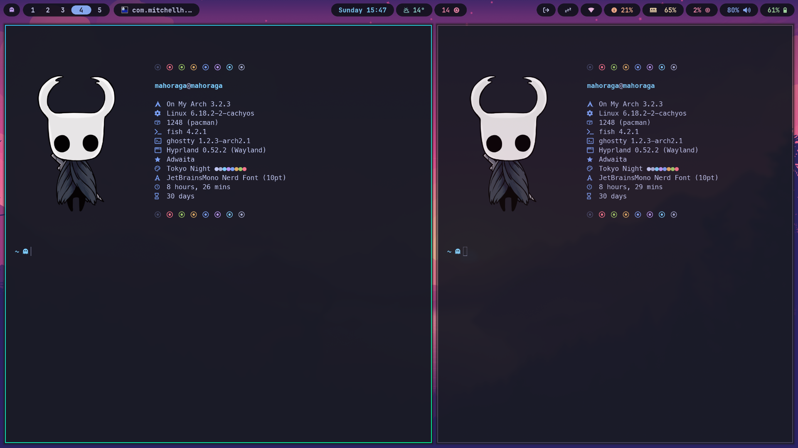

# DOT_RAGA 🐧✨


A vibrant, customized dotfiles suite specifically designed for **Omarchy Linux** users. DOT_RAGA brings curated UI/UX, thoughtful defaults, and an animated installer to get your Omarchy desktop lookin[...]

IMPORTANT: **These dotfiles are strictly for Omarchy Linux.** Using them on other distributions may break configs, window managers, or desktop environments. ⚠️

---

## 🚀 Quick Install

Run this exact command to install:

```bash
git clone https://github.com/Maho0Raga/dot_raga.git && cd dot_raga && chmod +x install.sh && ./install.sh
```

---

## What is DOT_RAGA? 💻

DOT_RAGA is a modular dotfiles collection tailored for Omarchy Linux. It focuses on modern aesthetics, usability, and safe deployment. The suite includes polished configurations for Waybar, Fastfetch,[...]

---

## install.sh — Interactive & Safe Installer 🚦

The included `install.sh` is an interactive, safe installer that aims to be friendly and non-destructive:

- Theme & UX
  - Uses a vibrant "Emerald-Neon" color theme throughout prompts and output.
  - Includes animated spinners and progress indicators for clarity and polish.
- Selective Installation
  - Presents an interactive menu so you choose which components to install (Waybar, Fastfetch, Hyprland pieces, Starship, etc.).
- Smart Backups (Safe by default)
  - Before replacing any existing configuration, the installer creates backups.
  - For folders (Waybar, Fastfetch, Hypr) it keeps a maximum of 2 backups to conserve disk space.
  - For `starship.toml` it maintains a single rotating backup file (keeps one previous version).
  - Backups are timestamped and stored in a dedicated backups directory inside your home dotfiles backup location.
- Dry-run & Confirmation steps
  - Installer confirms actions and shows a summary of changes before writing files.

---

## Features ✨

- Polished Waybar configuration tuned for Omarchy.
- Fastfetch config adapted for stylish system info.
- Hypr-related configs (lockscreen, theming, look & feel).
- Starship prompt integration for a snappy terminal experience.
- Example `assets/` folders for each module (icons, screenshots, sample images) so you can preview and modify visuals easily.
- Non-destructive: safe backups and selective installs.

---

## Assets preview 📸🎞️

Below are inline previews for the images and videos stored in the repository `assets/` folder. These use relative paths so they display directly on GitHub.

- Images are shown inline with captions.
- Videos use an HTML5 player with a poster image (if available) and a download link fallback for browsers that don't autoplay or render the video.

Waybar preview (image + video)


<video controls width="800" poster="assets/preview_1.png">
  <source src="assets/waybar_1.mp4" type="video/mp4">
  Your browser does not support the video tag. Download the video: [waybar_1.mp4](assets/waybar_1.mp4)
</video>

Fastfetch preview


Hypr/General preview (image + video)


<video controls width="800" poster="assets/preview_1.png">
  <source src="assets/preview_2.mp4" type="video/mp4">
  Your browser does not support the video tag. Download the video: [preview_2.mp4](assets/preview_2.mp4)
</video>

Notes:
- If a video does not appear inline on GitHub, use the downloadable link shown in the player fallback. GitHub sometimes disables inline playback for certain large files or content types.
- To add more previews, place images (PNG/JPG) or MP4 files under `assets/` and add the corresponding `` or `<video>` block in this section.
- For smaller galleries or side-by-side layout, consider using a markdown table or CSS via GitHub Pages.

Template snippet to add another asset (copy & edit):

```html
<!-- Image -->


<!-- Video with poster -->
<video controls width="800" poster="assets/my-module-poster.png">
  <source src="assets/my-module-demo.mp4" type="video/mp4">
  Your browser does not support the video tag. Download the video: [my-module-demo.mp4](assets/my-module-demo.mp4)
</video>
```

---

## Project Structure — Example File Tree 📁

Below is the repository structure and an example `assets/` folder included for each module:

- waybar/
  - assets/ (icons, example layouts, screenshots)
  - config
- fastfetch/
  - assets/ (images, example output)
  - config
- hypr/
  - assets/ (wallpapers, lockscreen images)
  - hyprlock.conf
  - looknfeel.conf
- omarchy/
  - assets/ (branding logos, guidelines)
  - branding/ (SVGs, readme)
- starship/
  - assets/ (prompt samples)
  - starship.toml
- install.sh

---

## Usage Notes & Recommendations

- Backup first: although the installer makes backups, create any extra snapshots you want before major changes.
- Only run on Omarchy Linux. This suite uses Omarchy conventions and config paths — other distributions may have different requirements.
- Review configs before applying if you run a highly customized environment.

---

## Contributing 🚀

Contributions, fixes, and aesthetic improvements are welcome. Please open issues or PRs on the GitHub repository and include screenshots or examples when proposing visual updates.

---

## Credits & Acknowledgments 🙏 (Crucial)

- Waybar: Based on the config by [Akshay Gupta](https://github.com/gupta-akshay/omarchy-waybar-config), heavily customized by me.
- Fastfetch: Based on the config by [LierB](https://github.com/LierB/fastfetch), adapted for DOT_RAGA.
- Base System: Built for the [Omarchy Linux](https://github.com/omarchy) ecosystem.

If you use or adapt these configs, please respect original authors' licenses and attribution.

---

## Support & Contact

For questions, issues, or aesthetic collaboration, open an issue on the repo: [Maho0Raga/dot_raga](https://github.com/Maho0Raga/dot_raga). Include your Omarchy version and a short description of your [...]

---

Thank you for checking out DOT_RAGA — a neon-bright toolkit to make your Omarchy desktop sing. 🚀
